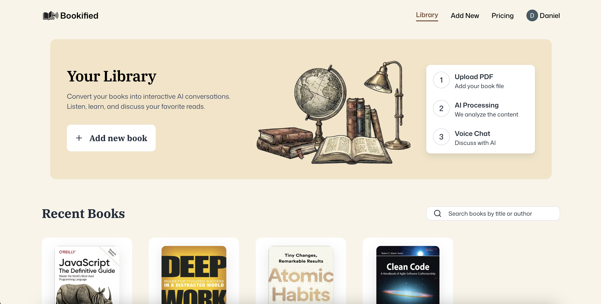

# 📚 Bookified

Bookified is an AI-powered reading platform that transforms uploaded books into an interactive, voice-enabled reading experience.

Users can upload PDF books, browse their personal library, search for books, listen to book content through AI-powered voice sessions, and interact with their books through a modern, responsive interface.

The project combines **Next.js, React, TypeScript, MongoDB, Clerk, Vapi, and Vercel Blob** to create a full-stack application focused on making digital reading more immersive and accessible.

---

## 🚀 Live Demo

**🌐 [Visit Bookified](https://bookified-woad.vercel.app/)**

## 💻 Repository

**[GitHub – Dsaar/bookified](https://github.com/Dsaar/bookified)**

---

## 📸 Preview

<div align="center">
  
</div>
```

---

# ✨ Features

### 📖 Digital Book Library

* Browse uploaded books
* View individual book pages
* Search through the book collection
* Organize and access previously uploaded books

### 📄 PDF Book Upload

* Upload PDF books directly through the application
* Client-side PDF processing
* Extract and process book content
* Store uploaded files using Vercel Blob

### 🤖 AI-Powered Book Experience

* AI-assisted book interactions
* Voice-based sessions with Vapi
* Selectable AI voices
* Interactive voice controls
* Session and transcript tracking

### 🔐 Authentication

* Secure authentication using Clerk
* Protected application functionality
* User-specific book and session data

### 💳 Subscription System

* Subscription-aware application features
* Subscription status management
* Server-side subscription logic
* Dedicated subscription page

### 🎨 Modern UI

* Responsive design
* Custom Bookified branding
* shadcn-style UI components
* Lucide icons
* Toast notifications
* Loading states and overlays
* Mobile-friendly layouts

---

# 🛠 Tech Stack

## Frontend

* **Next.js 16**
* **React 19**
* **TypeScript**
* **Tailwind CSS v4**
* **shadcn/ui**
* **Radix UI**
* **Lucide React**
* **React Hook Form**
* **Zod**

## Backend

* **Next.js Server Actions**
* **Next.js API Routes**
* **MongoDB**
* **Mongoose**

## Authentication

* **Clerk**

## AI & Voice

* **Vapi AI**
* AI-powered voice sessions
* Voice selection and transcript handling

## File Processing & Storage

* **PDF.js**
* **Vercel Blob**

## Deployment

* **Vercel**

---

# 🏗️ Architecture

Bookified follows a modern full-stack Next.js architecture.

```text
User
 │
 ▼
Next.js Application
 │
 ├── Clerk Authentication
 │
 ├── React / TypeScript UI
 │
 ├── Server Actions
 │     │
 │     ├── Book Management
 │     └── Session Management
 │
 ├── API Routes
 │     │
 │     ├── File Upload
 │     └── Vapi Search
 │
 ├── MongoDB / Mongoose
 │     │
 │     ├── Books
 │     ├── Book Segments
 │     └── Voice Sessions
 │
 ├── Vercel Blob
 │     └── PDF Storage
 │
 └── Vapi
       └── AI Voice Interaction
```

---

# 📁 Project Structure

```text
bookified/
│
├── app/
│   ├── (root)/
│   │   ├── books/
│   │   │   └── new/
│   │   ├── subscriptions/
│   │   └── page.tsx
│   │
│   ├── books/
│   │   └── [slug]/
│   │
│   ├── api/
│   │   ├── upload/
│   │   └── vapi/
│   │
│   ├── globals.css
│   └── layout.tsx
│
├── components/
│   ├── BookCard.tsx
│   ├── FileUploader.tsx
│   ├── HeroSection.tsx
│   ├── LoadingOverlay.tsx
│   ├── Navbar.tsx
│   ├── Search.tsx
│   ├── Transcript.tsx
│   ├── UploadForm.tsx
│   ├── VapiControls.tsx
│   └── VoiceSelector.tsx
│
├── database/
│   ├── models/
│   │   ├── book.model.ts
│   │   ├── book-segment.model.ts
│   │   └── voice-session.model.ts
│   └── mongoose.ts
│
├── hooks/
│   ├── useSubscription.ts
│   └── useVapi.ts
│
├── lib/
│   ├── actions/
│   │   ├── book.actions.ts
│   │   └── session.actions.ts
│   ├── constants.ts
│   ├── subscription-constants.ts
│   ├── subscription.server.ts
│   ├── utils.ts
│   └── zod.ts
│
├── public/
│   └── assets/
│
├── next.config.ts
├── package.json
└── proxy.ts
```

---

# ⚙️ Getting Started

## 1. Clone the repository

```bash
git clone https://github.com/Dsaar/bookified.git
```

## 2. Navigate to the project

```bash
cd bookified
```

## 3. Install dependencies

```bash
npm install
```

## 4. Configure environment variables

Create a `.env.local` file in the root of the project.

```env
MONGODB_URI=

NEXT_PUBLIC_CLERK_PUBLISHABLE_KEY=
CLERK_SECRET_KEY=

BLOB_READ_WRITE_TOKEN=

VAPI_API_KEY=
NEXT_PUBLIC_VAPI_PUBLIC_KEY=
```

Add any additional environment variables required by your configured authentication, subscription, and Vapi setup.

## 5. Start the development server

```bash
npm run dev
```

Open:

```text
http://localhost:3000
```

---

# 🧪 Available Scripts

### Development

```bash
npm run dev
```

Starts the Next.js development server.

### Production Build

```bash
npm run build
```

Creates an optimized production build.

### Production Server

```bash
npm run start
```

Starts the production server.

### Lint

```bash
npm run lint
```

Runs ESLint against the project.

---

# 🧠 What I Learned

Building Bookified gave me experience working across the full stack of a modern Next.js application.

### Full-Stack Next.js Development

I worked with:

* Server Components
* Client Components
* Server Actions
* API Routes
* Dynamic routes
* Server-side data fetching
* Authentication and protected functionality

### Database Design

I designed MongoDB models for:

* Books
* Book segments
* Voice sessions

Using **Mongoose** allowed the application to maintain structured relationships between uploaded content and voice interactions.

### File Upload & PDF Processing

The application required handling large PDF files, uploading them to cloud storage, and processing their contents.

This involved working with:

* PDF.js
* Vercel Blob
* Client-side uploads
* Server-side processing

### AI Voice Integration

Integrating **Vapi** introduced experience with:

* Voice-based AI interactions
* Voice selection
* Real-time session handling
* Conversation transcripts
* Client-side voice controls

### Authentication & Authorization

I implemented authentication using **Clerk** and connected authenticated users with their application data.

### Form Validation

Forms are handled using:

* React Hook Form
* Zod
* Custom validation schemas

This provides structured and type-safe user input handling.

---

# 🔮 Future Improvements

Some potential improvements for future versions include:

* 📚 Expanded book discovery and recommendations
* 🤖 More advanced AI book conversations
* 🗣️ Additional voice options
* 📊 Reading progress analytics
* 🔖 Bookmarks and highlights
* 📝 Personal notes
* 🌙 Dark mode improvements
* 📱 Progressive Web App support
* 📥 Additional ebook formats
* 🔊 More advanced audiobook controls
* 💳 Expanded subscription tiers

---

# 🚀 Deployment

The production version of Bookified is deployed using **Vercel**.

**Live application:**

https://bookified-woad.vercel.app/

The application connects to external services for authentication, database storage, file storage, and AI voice functionality.

---

# 👨‍💻 Author

## Daniel Saar

Full-Stack Developer focused on building interactive web applications, AI-powered experiences, and creative digital products.

* **GitHub:** https://github.com/Dsaar
* **Live Project:** https://bookified-woad.vercel.app/

---

# 📄 License

This project is licensed under the MIT License.
